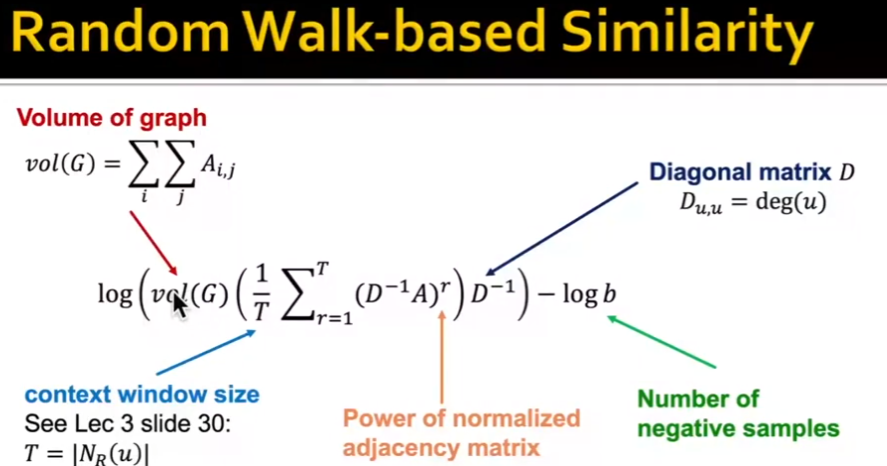
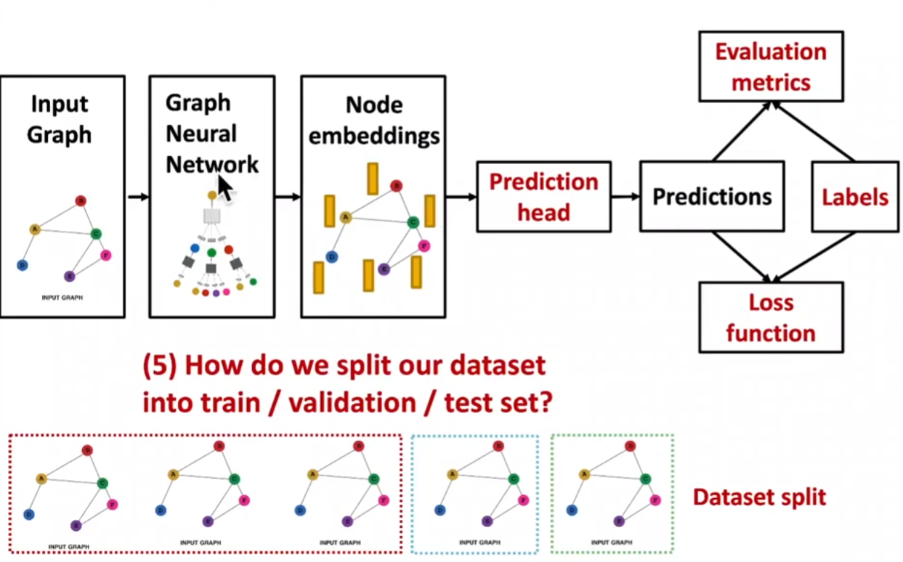

---
title: CS224W_notes
date: 2024-05-19 13:01:34
tags: 
mathjax: true
--- 

# 1 Introduciton，Machine learning for graphs

大纲
1. Traditional methods: Graphlets, Graph Kernels
2. Methods for node embeddings: DeepWalk, Node2Vec
3. Graph Neural Networks: GCN, GraphSAGE, GAT, Theory of GNNs
4. Knowledge graphs and reasoning: TransE, BetaE
5. Deep generative models for graphs
6. Applications to Biomedicine, Science, Industry
## Defs
0. $G=(V, E, F)$ or $G(V, E)$
1. Directed/ undirected
2. Degree \
Directed $\bar k = \langle k \rangle = \frac{1}{N} \sum_{i=1}^{N} k_i = \frac{2E}{N}$ \
Undirected in-degree + out-degree = (total) degree, $\bar k= \frac{E}{N}$ 
3. Bipartite Graph
4. Foleded/Projected Bipartite graph
5. Representing graphs: Adjacency matrix\
Density of matrix $\frac{E}{N^2}$
    1. adjacency matrix
    2. Edge List
    3. Adjacency List
6. Attribute of edges
7. Weighted/Unweighted
8. Self-dges
9. Connectivity: (Un)Directed, Strong Connnected Components (in Undirevted)

# 2 Traditional methods for ML on graph 
Structual Feature/ Node features
Train on Random Forest, SVM, Neural Network; Apply on new graph. 
### Node
#### 1) Node Centrality
   1. Eigenvector centrality: $c_v=\frac{1}{\lambda}\sum_{u\in N(v)} $
   2. betweenness centrality 
$$
c_v = \sum_{s \neq v \neq t} \frac{\#(\text{shortest paths between } s \text{ and } t \text{ that contain } v)}{\#(\text{shortest paths between } s \text{ and } t)} 
$$
$$
\#: \text{the number of} 
$$
3. closeness cnetrality 
$$
c_v = \frac{1}{\sum_{u\neq v} (\text{shortest path length between } u \text{ and } v)} 
$$

#### 2) Clutering Coefficient 
$$
e_v = \frac{\#(\text{edges among neighboring nodes})}{\binom{k_v}{2}} \in [0,1]

$$
#### 3) Graphlet: Rooted connected non-isomorphic subgraphs: 
graphlet degree vector
Clustering coefficient.

Feature-based/ structure-based features.

### Link
#### 1) Link prediction
1. Links missing at random:Remove a random set of links and then aim to predict them
2. Links over time:  Given $ G[t_0, t_0'] $ a graph on edges up to time $ t_0' $, output a ranked list $L$ of links (not in $ G[t_0, t_0'] $) that are predicted to appear in $ G[t_1, t_1'] $
#### 2) Local Neighborhood Overlap
- Common neighbors: $ |N(v_1) \cap N(v_2)| $
- Jaccard's coefficient:$\frac{|N(v_1) \cap N(v_2)|}{|N(v_1) \cup N(v_2)|}$,\
Normalize common neighbor, assuming having the smae number of neighbors
- Adamic-Adar index: $\sum_{u \in N(v_1) \cap N(v_2)} \frac{1}{\log k_u}$,\
Panelty those who have many neighbors
#### 3) Global Neighborhood Overlap 
- Katz index:$S_{uv}= \sum_{l=1}^{\infty} \beta ^l A^l_{uv}$, \
$A^l_{uv}: \# $ path of length $l$ between $vu$,\
$\beta$: discount factor, the contribution of long path  
- Katz index matrix: $S= \sum_{i=1}^\infty \beta^iA^i = (I-\beta A)^{-1}-I$

### Graph  
#### kernel method:
1. **Kernel function**:
   $ K(G, G') $ measures the similarity between two graphs $ G $ and $ G' $.\
   maps the graphs into a higher-dimensional space where linear methods can be applied to perform complex, non-linear tasks in the original space.

2. **Kernel Matrix**: $\mathbf{K} = \left( K(G, G') \right)_{G, G'} $ is a symmetric matrix.\
is positive semidefinite, meaning all its eigenvalues are non-negative.

3. **Feature Representation**:
   feature mapping $\phi(\cdot)$ kernel function is expressed as dot product in feature space: $ K(G, G') = \phi(G)\top \phi(G') $.

cite: https://blog.csdn.net/PolarisRisingWar/article/details/115598815
#### design graph featrue vector $\phi(G)$
**Bag-of-Words: BoW**\
key idea: use the word counts as features(#nodes as features, #degree, #graphlet, #color)

#### Graphlet features
key idea: Count the number of different graphlets in a graph.
$G_k=(g_1, g_2, \cdots, g_{n_k})$

graphlet count vector $(f_G)=\#(g_i\subseteq G),  i\leq n_k$

$h_G= \frac{f_G}{Sum(F_G)}$, \
$ K(G, G')=H_G^TH_G'$

NP-hard $O(nd^{k-1})$, expensive to calculate

#### Weisfeiler-Lehman Kernel
https://blog.csdn.net/PolarisRisingWar/article/details/117336622

# 3 Node Embedding
## 3.1 Intro
key: How define node similarity 
<!-- （是为了避免直接Feature Engineering, 而是也反应Structual上的特征  -->
###  Encoder
feature representation <-> feature embedding 
<!-- （如果两个节点在途中类似，那么这两个点在embedding space中也是类似的 -->
<!-- 用 dot product 来衡量类似度 -->
Similarity $(u, v)\approx z_u^T z_v$,\
$ENC(u)=z_u, ENC(v)=z_v$,\ <!--ENC: Encoder-->
$z_u, z_v$ d-dim in enbedding space, d usually 64-1000\
$ENC(v)$ node in the input garph

$ENC(v)=z_v=Z\cdot v$
Encoer is a lookup, embedding matrix$Z\in\R^{d\times|V|}, v\in I ^{|V|}$, 
#### ENC
Shallow encoder: $d*|V|$
some ways for ENC: Deepwalk, node2vec
## 3.2 Random walk for Node Embedding
### Notation
- Vector $z_u$: then embedding vecotr of node u(what we aim to find)
- $P(v|z_u)$: prob of visiting node $v$ on random walk start from u. Used to measure similarity. 
- Softmax: $\sigma(z)_i=\frac{e^{z_i}}{\sum e^{z_j}}$
- sigmoimd: $S(x)=\frac{1}{1+e^{-x}}$
### random walk embedding
Using random strategy $R$: $P_R(u|v)$
Given 
$G=(V, E)$
Goal: Learn a mapping $f: u\rightarrow \R^d$
$$
\mathcal{L} = \sum_{u \in V} \sum_{v \in N_R(u)} -\log\left(\frac{\exp(z_u^T z_v)}{\sum_{n \in V} \exp(z_u^T z_n)}\right)
$$
Negative sampling
$$
\log\left(\frac{\exp(z_u^T z_v)}{\sum_{n \in V} \exp(z_u^T z_n)}\right) \approx \log\left(\sigma(z_u^T z_v)\right) - \sum_{i=1}^{k} \log\left(\sigma(z_u^T z_{n_i})\right), \quad n_i \sim P_V
$$

### Random walk strategy 
#### Deepwalk
https://www.vldb.org/pvldb/vol10/p13-wu.pdf
#### node-2-vec
node2vec

Hyperparameter:
- $p$: Rerturn param
- $q$: in-out param 
## 3.3 Embedding Entire Graph
### aaproach 1
sum/mean $z_G=\sum_{v\in G}z_v$
https://arxiv.org/pdf/1509.09292
### approach 2
Vitual node
https://arxiv.org/pdf/1511.05493
### approach 3
Anonymous walk:
#### Sampling Anonymous walks
Distribution have error less than $\epsilon$ with prob, less than $\delta$
$m=f(\epsilon, \sigma, \delta)$
#### Walk Embedding
$\Delta$

# 4 Node Embedding using Random walk - PageRank
## 3.1 Intro
PageRank: $r_v=\sum_{u\in N_R(v)}r_u\frac{A_{u,v}}{d_u}$\
$d_u$: degree of node u\
$A_{u,v}$: adjacency matrix\
$r_v$: rank of node v\
$N_R(v)$: neighbors of node v

## 3.2 PageRank for Graph
$r_v=\sum_{u\in N_R(v)}r_u\frac{A_{u,v}}{d_u}$
$d_u$: degree of node u
$A_{u,v}$: adjacency matrix
$r_v$: rank of node v
$N_R(v)$: neighbors of node v

## 
$r_v=\sum_{u\in N_R(v)}r_u\frac{A_{u,v}}{d_u}$

## 
- Personalized PageRank (Tpoic specific pagerank)
rank proximity of nodes to the teleport nodes $S$,\
Proximity on graphs: 
- PageRank with restarters:

## Matrix Factorization
Frobenius norm: $min_z||A-Z^TZ ||$\

# 5 Mesaage passing & Node Classification
Classical methods

Correlation: nearby nodes have the same color\
$A_{n\times n}$: Adejacency matrix\
$Y=\{0, 1\}^n$

Collective Classification:
1. local classifier 2. Relational Classifier 3. Collective Inference
$1^{st} \text{order markov assumption  } P(Y_v)=P(Y_v|N_v)$

- Relational calssification
- Iterative classification 
- Belief propagation

# 6 GNN Model 

# 7 GNN Design Space

# 8 Training GNN 
## 8.1 Data augmentation
### Feature based 
### Structure based

## 8.2 

## 8.3 

Node Prediction
transductive setting
Inductive setting 

Training Validation(tuning hyperparam) test set

Graph Prediction
Link Prediction

# 9 Theory of GNN
GCN, GAT, GraphSAGE, designspce 

## 9.1
## 9.2
GCN Mean pooling fails 
GraphSAGE mean-pool 

Injective Multiset function: $\Phi(\cdot)$: a non linear funciton:\
$\Phi(\sum_{x\in S}f(x))$:
Multi-layer Perceptron
Theorem:: Universal approximation theorem 
can arrive at a neural network can model any injective multiset function:
$MLP_{\Phi}(\sum_{x \in S})MLP_{f}(x)$

Graph Isomorphism Noetwork (GIN) Xue 2019 

WL Graph Kernel 
Hash
$
\left( c^{(k)}(v), \{ c^{(k)}(u) \}_{u \in N(v)} \right) 
$

$
\text{MLP}_{\Phi} \left( (1 + \epsilon) \cdot \text{MLP}_{f}(c^{(k)}(v)) + \sum_{u \in N(v)} \text{MLP}_{f}(c^{(k)}(u)) \right) $

where $\epsilon$ is a learnable scalar

$c^{(k+1)}(v) = \text{HASH} \left( c^{(k)}(v), \{ c^{(k)}(u) \}_{u \in N(v)} \right)$

$\text{GINConv} \left( c^{(k)}(v), \{ c^{(k)}(u) \}_{u \in N(v)} \right) = \text{MLP}_{\Phi} \left( (1 + \epsilon) \cdot c^{(k)}(v) + \sum_{u \in N(v)} c^{(k)}(u) \right)
$

# 10 Hetergenous Graphs and Knowldege Graph Enbeddings
## 10.1
### Hetergeneous Graphs 
$G=(V, E, R, T)$

## RGCN

# VGAE
讲的比较好的GAE和VGAE
1. https://www.atyun.com/17976.html
2. https://spaces.ac.cn/archives/5253#%E7%BB%88%E7%82%B9%E7%AB%99
3. https://blog.csdn.net/qq_16763983/article/details/120403055?spm=1001.2101.3001.6650.7&utm_medium=distribute.pc_relevant.none-task-blog-2%7Edefault%7EBlogCommendFromBaidu%7ERate-7-120403055-blog-119531815.235%5Ev43%5Epc_blog_bottom_relevance_base8&depth_1-utm_source=distribute.pc_relevant.none-task-blog-2%7Edefault%7EBlogCommendFromBaidu%7ERate-7-120403055-blog-119531815.235%5Ev43%5Epc_blog_bottom_relevance_base8&utm_relevant_index=13

CNN code"
1. CNN 网络结构与部分pytorch： https://www.cnblogs.com/wpx123/p/17616156.html, https://www.cnblogs.com/wpx123/p/17621303.html

Optimizer：
SDG, GD, Adam 都是Optimizer的种类
1. pytorch源代码解读， 以及各种参数lr, gamma的影响: https://zhuanlan.zhihu.com/p/346205754
2. 简单讲解了SGD， Adam的原理： https://blog.csdn.net/xian0710830114/article/details/126551268

一个比较有用的Casual Inference 综述的博客：https://www.cnblogs.com/caoyusang/p/13518354.html

